# 面试题库 · 03 编程 / 画图大题

> **用途：** 收录**需要动手写代码**（函数/程序/宏/汇编/伪代码）或**需要看图 / 画图**（电路图、波形图、时序图、流程图、配图计算与分析）的题目。这类题无法"打字对照答案"式刷题，因此不进入 `02_主观题.md`。
> **来源：**
>   - **第一部分**：从 `02_主观题.md` 迁出的 **33 题**，编号沿用原主观题编号（6、7、8、29 … 386），便于与原题库对照，因此编号不连续。
>   - **第二部分**：`面试题md\_题库\03_编程画图大题.md` 汇编的 **80 题**，本文件统一编号 **401~480**，原卷出处见每题"来源"行。
> **说明：** 编程题给出参考实现；画图 / 设计题给出图面要点与参考文字描述；配图已同步到 `imgs/` 目录，可直接查看。
> **可选玩法：** 本文件也放在"题库"文件夹内，可用「更新题库」把它当作一个独立题库导入软件（作答方式与主观题一致：打字作答 → 对照参考答案），专门练大题。


---

## 一、从主观题题库迁出的题目（33 题，编号沿用 02_主观题.md）

### 2022 年

#### 2022面试题1


**6.** Y 字型铁路调度题：左边停了 N 个车厢（编号 1～N），通过 Y 字型铁轨把所有车厢拉到右边，所有车厢不允许走重复的路径。请列出当所有列车拉到右边铁路后，右边列车所有可能的排法。

**参考答案：** 该问题等价于"1~N 依次入栈（push）、再在任意时刻出栈（pop）"的栈排列问题：Y 型铁轨的竖直段相当于一个栈，车厢只能后进先出，且不允许走重复路径保证每节车厢恰好经过一次，因此右边可能的排列就是 1~N 的全部合法出栈序列。
枚举与判定方法：按候选输出序列扫描，用栈模拟——需要时把 1,2,3… 依次压栈，若栈顶等于当前待输出车厢则弹出，否则继续压栈；能完整输出则序列合法。N 不大时应按序（如字典序）逐一列出全部合法序列，再剔除非法排列。
合法序列总数为卡特兰数 C(2N,N)/(N+1)。判定口诀：合法出栈序列不会出现"先输出较大的 b、再输出较小的 a、最后又输出介于两者之间的 c（a<c<b）"这一 312 模式；例如 N=3 时 6 个排列中只有 312 非法，合法序列共 5 种。
**得分点：** ①识别为栈（后进先出）排列问题并说明映射关系 ②给出全部合法序列（或明确枚举/合法性判定方法）③总数 = 卡特兰数 C(2N,N)/(N+1) ④加分：给出 312 模式判定或 N=3 的列举示例。

**来源：** 2022面试题1 铁路调度题（Y 字型铁轨图）（[图](../imgs/fig-4-railway.png)）
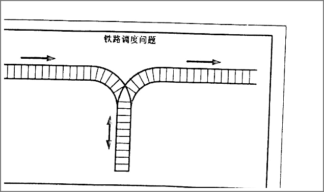
---

**7.** Serial2Parallel 模块（内部 16 个 D 触发器，输入 SerIn、SerClk、ParClk，输出 8 位 ParDataOut）：请简要说明该模块实现的功能。

**参考答案：** 该模块实现"串行转并行"（Serial2Parallel）功能：16 个 D 触发器通常分为两级——第一级 8 个接成 8 位移位寄存器，在 SerClk 每个有效沿把 SerIn 上的数据逐位移入（先入数据逐步移向高位或低位，取决于方向定义）；第二级 8 个作为输出寄存器，当 ParClk 有效时把移位寄存器当前的 8 位值一次性并行锁存并送到 ParDataOut。这样连续 8 个 SerClk 周期可收到一个字节，随后一个 ParClk 脉冲把它搬运到并行输出。两级寄存的意义是：移位期间输出保持稳定、避免出现中间态；时序上要求 ParClk 在移位完成后、满足建立/保持时间给出。
**得分点：** ①SerClk 控制下逐位移入（8 位移位寄存器）②ParClk 到来时并行锁存/输出 ③功能本质：8 位串行→并行转换 ④加分：两级寄存可隔离移位过程与输出、防止中间态。

**来源：** 2022面试题1 第 7 题（Serial2Parallel 模块图）（[图](../imgs/fig-7-s2p.png)）
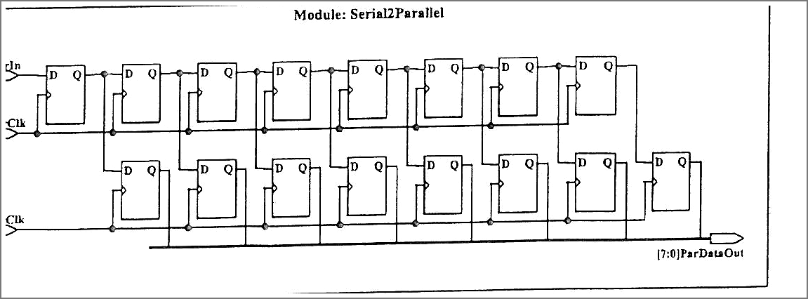
---

**8.** 同步信号纠正电路（两级 D 触发器 + RC 延时）：(b) 简述电路工作原理；(c) 输出点 C 与输入点 A 的占空比是否相同？为什么？（图见 2022面试题1）

**参考答案：** (b) 电路由"RC 低通延时 + 两级 D 触发器"组成：RC 网络先对输入做低通滤波，滤除窄的干扰脉冲并减缓跳变边沿；两级串联的 D 触发器再用同一时钟对滤波后的信号连续打两拍，作用一是把输入与本地时钟同步、抑制亚稳态传播（第一级可能出现亚稳态，由第二级稳定下来），二是要求输入电平至少稳定两个时钟周期才被确认，从而把窄毛刺彻底滤掉，输出 C 只在信号稳定后才随时钟沿翻转。(c) 一般不相同：①被 RC 和触发器滤除的窄脉冲/毛刺改变了高、低电平的持续时间，占空比随之变化；②所有跳变都被对齐到时钟沿并延迟约两个时钟周期，脉宽按整拍变化（可能多落一拍）。只有输入 A 无毛刺、每个电平都远宽于一个时钟周期且与时钟同步时，C 与 A 的占空比才基本相同。
**得分点：** ①RC 滤波去毛刺 + 两级触发器同步/打拍（防亚稳态）②占空比结论：通常不同，原因＝窄脉冲被滤除、跳变对齐时钟沿使脉宽改变 ③加分：输入干净且同步时两者基本相同。

**来源：** 2022面试题1 第 9 题（同步信号纠正电路 + 波形图）（[图](../imgs/fig-9-circuit.png)、[图](../imgs/fig-9-wave.png)）
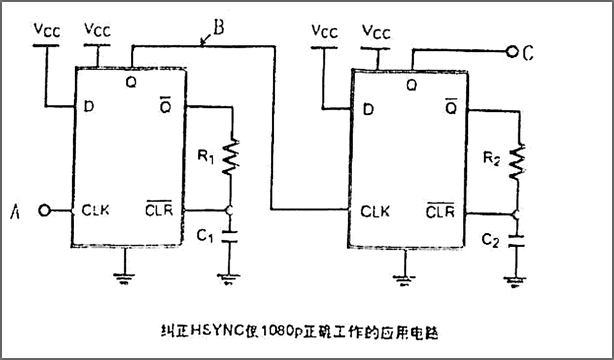
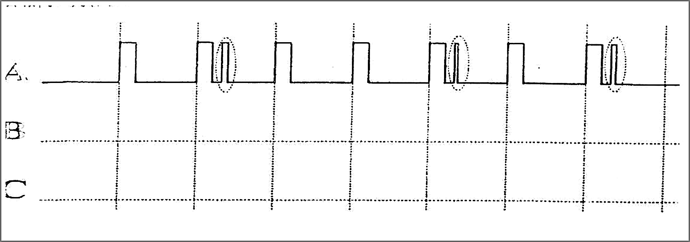
---


#### 2022面试题4（C/C++/Java 笔试题）


**29.** 在某工程中，要求设置一绝对地址为 `0x67a9` 的整型变量的值为 `0xaa66`。写代码去完成这一任务。

**参考答案：** `*(volatile int *)0x67a9 = 0xaa66;`
写法规格：把常数 0x67a9 强制转换为整型指针，再解引用赋值；必须加 volatile，因为该地址是硬件寄存器/内存映射地址，编译器不得把它优化掉或缓存。
注意：①地址应在有效可写范围内（本题假定 0x67a9 合法），驱动中真实地址来自数据手册或 ioremap 映射结果；②访问宽度由指针类型决定，写 `*(volatile uint32_t *)0x...` 更严谨地表达 32 位访问；③未对齐访问在 ARM 上可能触发 HardFault；④内核/裸机中通常用 `writel(val, addr)` 等访问器函数。
**得分点：** ①`*(int *)0x67a9 = 0xaa66;` 强制转换+解引用正确 ②加分：加 volatile、说明访问宽度/对齐/访问器函数等注意事项。

---

### 2023 年

#### 2023面试题-1（期末考试卷）


**32.** C 语言中，请用宏定义的方法判断两个数的大小。

**参考答案：** `#define MAX(a,b) ((a) > (b) ? (a) : (b))`（MIN 同理，把 > 改为 <）。
要点：①整个表达式要加括号——否则 `2*MAX(1,3)` 展开成 `2*1>3?1:3`，被运算符优先级打乱；②每个参数都要加括号——否则 `MAX(1 & 3, 0)` 中 `&` 优先级低于 `>` 会出错；③宏参数可能被求值两次（`MAX(i++, j)` 会多次自增），带副作用的表达式慎用；④更安全的做法是用 `static inline int max(int a,int b){ return a>b?a:b; }`（C++ 可用模板/std::max）。
**得分点：** ①三目表达式形式正确 ②整体括号+参数括号完整（缺括号要扣分）③加分：指出副作用/优先级陷阱或给出 static inline 替代。

---

**33.** 第二个清 a 的 bit 3（设置/清除各一个函数），两个操作中要保持其他位不变。

```c
static int a;

void set_bit3(void)
{//设置 a 的 bit 3
}

void clear_bit3(void)
{//清 a 的 bit 3
}
```

**参考答案：**
```c
void set_bit3(void)   { a |= (1 << 3); }    /* 置位：与 1 相或 */
void clear_bit3(void) { a &= ~(1 << 3); }   /* 清位：与取反后的掩码相与 */
```
说明：`1 << 3` = 0x08 只选中 bit 3。置位用“或”保证其它位不变（0|0=0、1|0=1）；清位用“与掩码取反”（~(1<<3)=0xF7）保证其它位不变（x&1=x）、bit3 变 0。a 是文件内 static 变量，函数直接访问；若 a 可能被中断同时修改，读—改—写过程要加临界区保护；掩码可写 `1u << 3` 更规范。
**得分点：** ①置位 `|= (1 << 3)` ②清位 `&= ~(1 << 3)` ③保持其它位不变的原理 ④加分：临界区/无符号掩码细节。

---


#### 2023面试题-3（软件试题）


**50.** 写一个"标准"宏 MIN，这个宏输入两个参数并返回较小的一个。

**参考答案：** `#define MIN(a,b) ((a) < (b) ? (a) : (b))`
说明：①外层括号与每个参数的括号都不能省——“标准”宏的含义就是任何上下文展开后优先级都不出错（如 `2*MIN(3,4)` 应展开为 2*(3<4?3:4)）；②参数出现两次，`MIN(i++, j)` 这类带副作用的实参会多次求值，面试可主动指出；③C++ 中更推荐 `std::min` 或模板函数，C 中可用 static inline 函数替代。
**得分点：** ①三目表达式正确 ②参数与外层括号完整 ③加分：指出副作用陷阱/替代方案。
**来源：** 2023面试题-3 第 9 题；重复出现于 2025面试题-1/7、2025面试题-4、2026面试题-1 天嵌、2026面试题-14（已合并）

---

**51.** 写出 `float x` 与"零值"比较的 if 语句。

**参考答案：** 浮点数有表示误差（如 0.1 不能精确表示）且运算会累积误差，不能写 `x == 0`，应判断绝对值小于一个精度阈值：`if (fabs(x) < 1e-6)`（等价 `if (x > -1e-6 && x < 1e-6)`）。
补充：①阈值按实际精度选取：float 一般 1e-6~1e-5，double 可用 1e-9~1e-12；②需包含 `<math.h>`；③若比较两个量“接近”而非“等于零”，可用 `fabs(x - y) < eps` 或相对误差 `fabs((x-y)/y) < eps`。
**得分点：** ①用 fabs(x) < eps 或区间判断（不能 == 0）②说明浮点的表示/累积误差原因 ③加分：eps 取值、相对误差。

---


**58.** 分析下面 AB 间、AD 间的阻值是多少，每个电阻 10K。（三角形电阻网络图）

**参考答案：** 原图结构：外圈三角形 A-B、B-C、C-A 每边一只 10K 电阻；内部从 A、B、C 各引一只 10K 电阻汇到中心节点 D（共 6 只电阻）。
A-B 间：由对称性可知 C、D 两点电位相同（各自经一只 10K 接 A、接 B），C-D 间无电流可先断开；于是 A-B 等效为三条支路并联——直连 A-B 10K、经 C 的 10K+10K=20K、经 D 的 10K+10K=20K：R_AB = 1/(1/10+1/20+1/20) = 5 KΩ。
A-D 间：由对称性 V_B = V_C（B-C 间无电流可断开）；经 B 的支路 10K+10K=20K 与经 C 的支路 20K 并联得 10K，再与直连 A-D 的 10K 并联：R_AD = 10K ∥ 10K = 5 KΩ。
也可用 △-Y 变换验证：内部三只 10K 星形（中心 D 浮空）等效为 30K 三角形，与外部 10K 三角形并联，每对节点间等效为 20/3 K ∥ 20 K = 5 K。
**得分点：** ①辨认网络结构（外三角形 3 只 + 内星形 3 只，均 10K）②利用对称性判断 C、D 等电位（或 △-Y 变换）③结果：A-B 间 5 KΩ ④结果：A-D 间 5 KΩ。
**来源：** 2023面试题-3 嵌入式第 4 题（[图](../imgs/fig-4-resistor.png)）
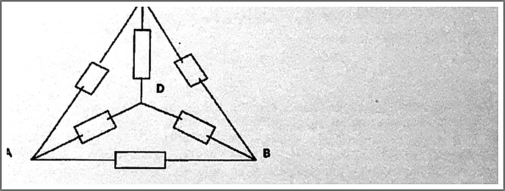

---


#### 2023面试题-4（嵌入式笔试测试卷）


**75.** 请写出常量指针和指针常量的代码形式，并简述他们的区别。

**参考答案：** ①常量指针（指向常量的指针）：`const int *p;`（等价 int const *p;）——*p 不可改（不能通过 p 修改所指对象），p 本身可改指向别处；const 在 * 左侧。②指针常量（指针本身是常量）：`int *const p = &x;`——p 定义时必须初始化，之后不能改指向，但 *p 可改；const 在 * 右侧。③记忆/判读：从变量名向外读，或看 const 与 * 的相对位置——“const 靠谁谁只读”。④组合形式：`const int *const p = &x;` 指针与所指对象都只读；函数参数中常用 `const int *p` 表示“不修改实参所指内容”。
**得分点：** ①常量指针 `const int *p`：值不可改、指向可改 ②指针常量 `int *const p`：指针不可改（须初始化）、值可改 ③加分：`const int *const` 组合、const 位置判读口诀。

---


### 2024 年


#### 2024面试题-3（4 份试卷合集）


**124.** 下图中，当按下按键，IO 口读取到的是？为什么？（按键上拉电路）

**参考答案：** 读到低电平。原理：按键 K2 接在 IO（PC13）与 GND 之间，节点由 R65（4.7K）上拉到 3V3——松开时被上拉为高；按下时 IO 直接接地，读到低电平。C61（104 = 0.1µF）与上拉电阻构成 RC 滤波，吸收按键机械抖动的毛刺（硬件去抖）；软件仍可配合“延时二次确认”消抖。该 IO 应配置为输入（上拉或浮空），不能输出。
**得分点：** ①低电平 ②上拉电阻/按下接地的原理 ③加分：C61 硬件去抖或“输入模式配置”。
**来源：** 2024面试题-3 试卷一（[图](../imgs/fig-3-key.png)）
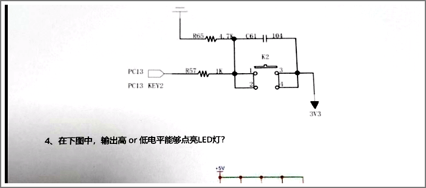

---

**125.** 在下图中，输出高 or 低电平能够点亮 LED 灯？（三极管驱动电路）

**参考答案：** 输出高电平点亮。电路为 NPN（SS8050）低侧开关：LED 阳极接 +5V，阴极经限流电阻 R20（100Ω）接集电极，发射极接地。驱动信号经 R23（1k）加在基极：高电平时 VBE 正偏（约 0.7V）→ 三极管饱和导通，电流由 +5V 经 LED、R20、三极管入地，LED 点亮；低电平时截止、不亮。R23 限制基极电流，R20 限制 LED 电流。若换成 PNP 高侧开关，则高低电平关系相反。
**得分点：** ①高电平点亮 ②NPN 导通原理（VBE 正偏→饱和导通、电流路径） ③加分：说明 R23/R20 作用或与 PNP 电路对比。
**来源：** 2024面试题-3 试卷一（[图](../imgs/fig-4-led.png)）
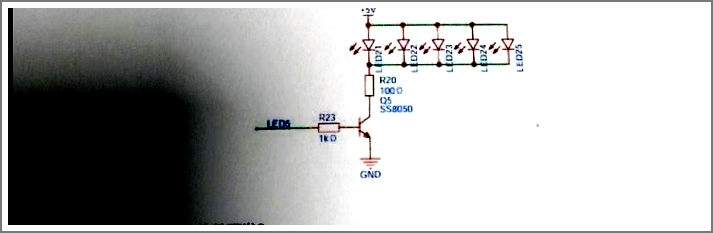

---


**131.** 下图中拉电流为 PB_0，灌电流为 PB_1。请简述拉电流与灌电流的区别。

**参考答案：** 拉电流（source）：IO 输出高电平，电流从 IO 流出、经负载回到 GND，负载接在 IO 与 GND 之间，IO“拉出”电流；灌电流（sink）：IO 输出低电平，电流从电源经负载灌入 IO 再流入内部地，负载接在电源与 IO 之间，IO“吸收”电流。工程要点：多数 MCU 灌电流能力≥拉电流能力（例如 51 的 P0 口灌电流可达 10~20mA，拉电流极小需外接上拉），所以 LED、蜂鸣器常用“低电平有效”的灌电流驱动；STM32 两者相近（单脚约 ±8~±20mA），但还要满足单脚与整片总电流上限。
**得分点：** ①拉电流：IO 输出高、向外供电流 ②灌电流：IO 输出低、吸收灌入的电流 ③加分：灌电流能力强于拉电流、LED 常用低电平点亮。
**来源：** 2024面试题-3 试卷四第 1 题（[图](../imgs/fig-hw-1.png)）
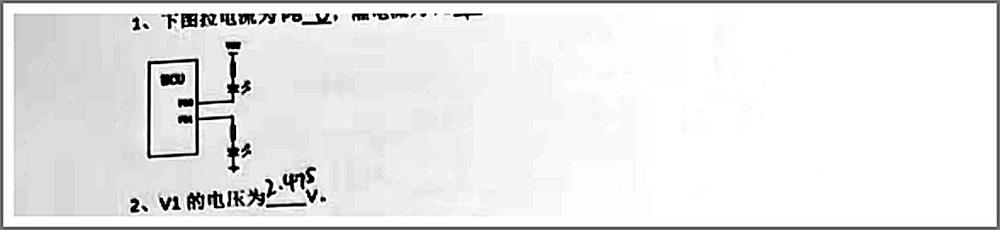

---

**132.** V1 的电压为**\_\_\_\_**V。（分压电路 R1=10K、R2=20K，3.3V 供电）

**参考答案：** 2.2V。分压公式：V1 = VCC × R2/(R1+R2) = 3.3 × 20/(10+20) = 2.2V（R2 为下臂、接地侧电阻）。
**得分点：** ①分压公式 V1=VCC×R2/(R1+R2) ②结果 2.2V。
**来源：** 2024面试题-3 试卷四（[图](../imgs/fig-hw-2.png)）
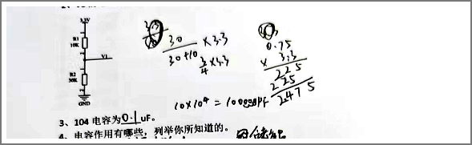

---


**137.** 下图为**\_\_\_\_**型（P/N）MOS 管，1 脚**\_\_\_\_**极，2 脚**\_\_\_\_**极，3 脚**\_\_\_\_**极。

**参考答案：** N 沟道；1 脚栅极（G）、2 脚漏极（D）、3 脚源极（S）。判定：看衬底（箭头）方向——箭头由衬底指向沟道内部为 N 沟道，箭头指向外为 P 沟道；符号中水平引出线是栅极 G，上、下两个端子分别是漏极 D 和源极 S（箭头标在源极侧）。另：增强型与耗尽型看沟道线是断续（增强型）还是整条实线（耗尽型）。
**得分点：** ①N 型判断正确 ②1=G、2=D、3=S ③加分：给出箭头/沟道线的判别依据。
**来源：** 2024面试题-3 试卷四第 7 题（[图](../imgs/fig-7-mos.png)）
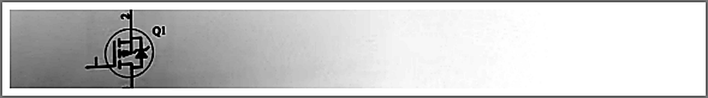

---


**139.** 下图哪些三极管处于放大状态**\_\_\_\_**。（A~D 四组偏置电路）

**参考答案：** 放大状态的是 A、D。判据：发射结正偏（UBE≈0.7V，NPN 中 UB>UE）、集电结反偏（UC>UB）。逐组看：①A 组 C=+2V、B=+0.7V、E=0V——UBE=0.7V 正偏、UCB=1.3V 反偏，放大；②B 组 C=+12V、B=+2V、E=+3V——UBE=−1V，发射结反偏，截止；③C 组 C=+10.3V、B=+10.75V、E=+10V——UBE=0.75V 正偏，但 UB>UC（集电结正偏），饱和；④D 组 C=0V、B=−5.3V、E=−6V——UBE=0.7V 正偏、UCB=5.3V 反偏，放大。
**得分点：** ①“发射结正偏、集电结反偏”的判据 ②结论 A、D（并说明 B 截止、C 饱和） ③加分：逐组给出两结偏置关系。
**来源：** 2024面试题-3 试卷四第 9 题（[图](../imgs/fig-9-bjt.png)）
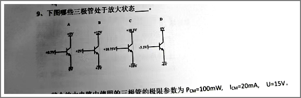

---

#### 2024面试题-4（多份试卷合集）


**147.** 完成链表逆置函数 reverse（填空①②③④）：

```c
Struct node* reverse(struct node *head)
{
    struct node *p,*temp1,*temp2;
    if(head==NULL ① ) return head;
    p=head->next;head->next=NULL;
    while( ② )
    {
        temp1=head;
        ③ ;
        temp2=p;
        p=p->next;
        ④ ;
    }
    return head;
}
```

**参考答案：** ① `|| head->next==NULL`（空链表或单节点直接返回）　② `p != NULL`（还有未处理节点）　③ `head = p`（新链表头前移到当前节点）　④ `temp2->next = temp1`（把刚摘下的节点接到已逆置链表头部）。思路：断开头节点后循环做头插：每轮保存旧头 temp1、头指针前移、再反转指针方向，最后返回 head；时间复杂度 O(n)、空间 O(1)。
**得分点：** ①每空 1 分：|| head->next==NULL / p != NULL / head = p / temp2->next = temp1 ②加分：说明头插法思路或 O(n)/O(1) 复杂度。

---


### 2025 年


#### 2025面试题-2（软件工程师面试笔试试卷 - 3）


**179.** 请根据下图电路说出 PA8 应该配置为 GPIO 中的什么模式。（PA8—按键—R0=10K 上拉到 VCC）

**参考答案：** 配置为输入模式（GPIO_MODE_INPUT）。电路外部已有 R0=10K 上拉到 VCC，因此内部可配“浮空输入”，让外部上拉决定电平；若想增强抗干扰也可开内部上拉（并联后阻值略降、电平不变）。读取逻辑：按键松开时被上拉为高，按下时接通 GND 为低。注意：绝不能配置为输出（按下时可能与外部驱动产生大电流）；该引脚若被复用为其他外设也需先释放复用。
**得分点：** ①输入模式 ②上拉/按下电平逻辑（松开高、按下低） ③加分：浮空 vs 内部上拉的选择理由或“不可配输出”。
**来源：** 2025面试题-2 第 7 题（[图](../imgs/fig-7-gpio.png)）
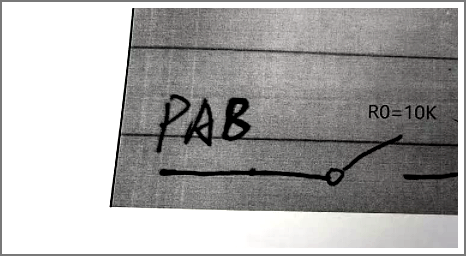

---

**180.** 下图中，AD 引脚为单片机中的一个 ADC 引脚，请根据图中的内容写出 AD 引脚电压 V_AD 的表达式，以及 AD_Value 的表达式。（VCC=3.3V、R1=10k、Rx 分压）

**参考答案：** V_AD = VCC × Rx/(R1+Rx) = 3.3 × Rx/(10k+Rx)（单位 V）；AD_Value = 4095 × V_AD/VCC = 4095 × Rx/(10k+Rx)（向下取整）。说明：R1 为上臂、Rx 为下臂；12 位 ADC 满码为 4095，采样值 = 输入电压/参考电压 × 4095；若 ADC 参考电压与 VCC 一致，则 AD_Value 只取决于电阻比值、与 VCC 无关（VCC 波动不影响读数，是该电路的优点）。
**得分点：** ①V_AD=VCC×Rx/(R1+Rx) ②AD_Value=4095×(V_AD/VCC) ③加分：说明 4095 满码或“比值与 VCC 无关”的优点。
**来源：** 2025面试题-2 第 8 题（[图](../imgs/fig-8-adc.png)）
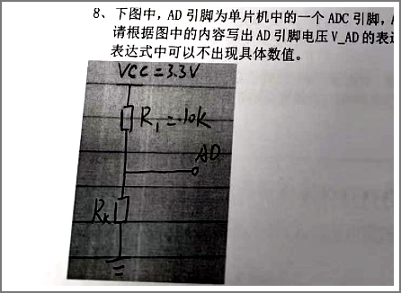

---

#### 2025面试题-3（多份试卷合集）


**196.** 下图发光二极管 VF=2V，IF=10mA，那么图中的限流电阻应该为\_\_\_\_。（+5V 供电）

**参考答案：** 300Ω。公式：R = (VCC − VF)/IF = (5−2)V/10mA = 300Ω（实际可选标称值 300Ω，或 330Ω 稍暗）。校验功耗：P = I²R = (10mA)²×300Ω = 0.03W，1/4W 电阻即可。要点：限流电阻必须串联在 LED 回路中，否则电流失控会烧 LED。
**得分点：** ①公式 R=(VCC−VF)/IF ②结果 300Ω ③加分：功耗校验或标称值选择。
**来源：** 2025面试题-3 卷4（[图](../imgs/fig-11-led.png)）
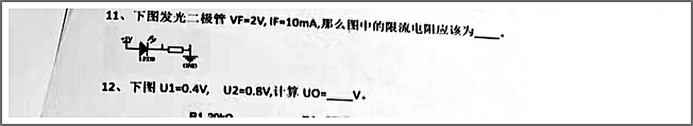

**197.** 下图 U1=0.4V，U2=0.8V，计算 UO = \_\_\_\_V。（运放电路 R1=20k、R2=20k、R3=10k、R4=30k，±6V 供电）

**参考答案：** UO = −1.8V。电路为反相加法器：U1、U2 经 R1、R2 接到反相端，反相端虚地（≈0V，同相端经 R3 接地），流入反馈支路的总电流 I = U1/R1 + U2/R2 = 0.4/20k + 0.8/20k = 20µA + 40µA = 60µA；故 UO = −I×R4 = −60µA×30kΩ = −1.8V。R3 为平衡电阻，不参与计算；±6V 供电下 −1.8V 未饱和。
**得分点：** ①虚短虚断列式（I = U1/R1 + U2/R2） ②UO = −R4×I = −1.8V ③加分：说明 R3 为平衡电阻或核对未饱和。
**来源：** 2025面试题-3 卷4（[图](../imgs/fig-12-opamp.png)）
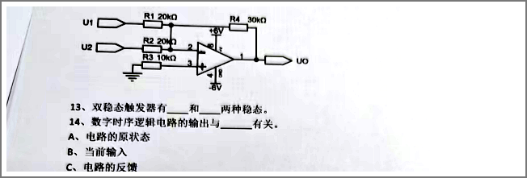

**200.** BACK3 为高电平，ACC3 电平？BACK3 为低电平，ACC3 电平？（BAT54C 双肖特基电路）

**参考答案：** BACK3 为高电平时 ACC3 为低电平；BACK3 为低电平时 ACC3 为高电平（≈VCC_AC）。按图分析：Q1（MMBT3906，PNP）构成高侧开关——发射极接 VCC_AC，基极经 R1（10K）上拉到 VCC_AC、经 R2（1K）接 BACK3。①BACK3 低（≈0V）时，基极被 R2 拉低（分压约 VCC_AC×1K/(1K+10K)），VEB≈0.91×VCC_AC > 0.7V，PNP 导通，ACC3 输出高电平；②BACK3 高（与 VCC_AC 同域）时 VEB≈0V，PNP 截止，ACC3 失去驱动、被负载/下级泄放为低电平。C1、C2 为输出滤波电容，R1 保证默认截止。
**得分点：** ①BACK3 高→ACC3 低；BACK3 低→ACC3 高 ②用 PNP（VEB>0.7V 导通）分析 ③加分：说明 R1/R2 作用或“反相开关”。
**来源：** 2025面试题-3 卷5（[图](../imgs/fig-6-bat54c.png)）
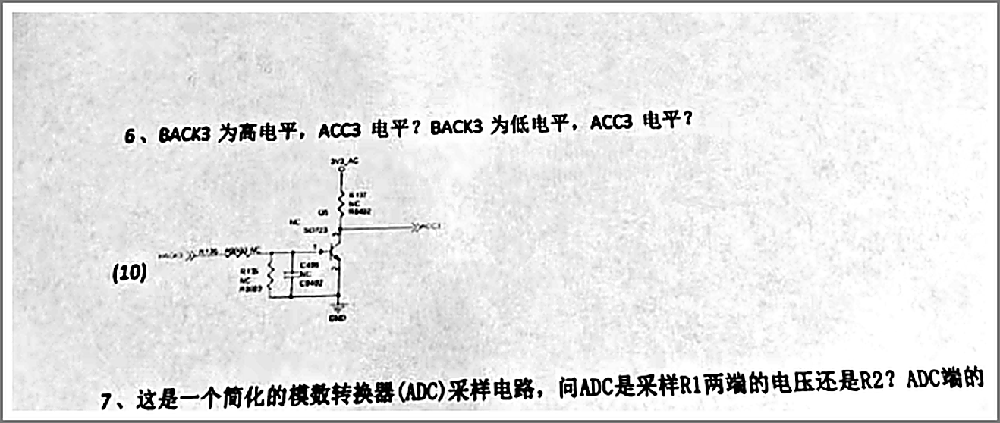

**201.** 简化的 ADC 采样电路，问 ADC 是采样 R1 两端的电压还是 R2？ADC 端的电压值怎么表示？（VIN、R2、R1）

**参考答案：** 采样的是 R1 两端的电压（ADC 节点位于 R2 与 R1 之间）。节点电压 V_ADC = VIN × R1/(R1+R2)：VIN 经 R2、R1 串联分压，ADC 测的正是 R1 上的分压。依据：ADC 测量的是“对地电压”，而 R1 一端接地、一端接节点，所以采样值由 R1 决定；R2 起串联分压/限流作用。工程要点：分压电阻取值要与 ADC 输入阻抗匹配（必要时加电压跟随器缓冲），取太大易被输入阻抗与噪声影响、取太小则静态功耗大；采样点常加 RC 滤波与钳位保护。
**得分点：** ①指明采样 R1（对地）端的电压 ②写出分压公式 V_ADC=VIN×R1/(R1+R2) ③加分：说明电阻取值/输入阻抗匹配或滤波保护。
**来源：** 2025面试题-3 卷5（[图](../imgs/fig-7-adc.png)）
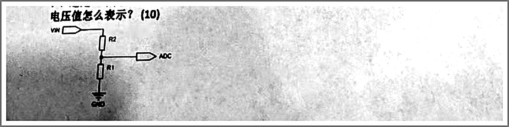

---

**208.** 现在有输出口 P0，对应 8 个灯（灯 1-8），高电平亮灯，有函数 `delayms(int ms)`。现在需要让灯 4 每 500ms 亮灭一次，其余灯不变，代码如何写？（灯 4 对应 P0 第 3 位）

**参考答案：**
```c
while(1) {
    P0 ^= (1 << 3);   /* 灯4 对应 P0.3：异或翻转该位，其余位不变 */
    delayms(500);     /* 每 500ms 翻转一次，亮/灭各 500ms */
}
```
要点：①(1<<3) 生成只含 bit3 的掩码 0x08，异或后仅翻转灯 4；②用 ^=（异或）而非直接赋值，才能“其余灯不变”；③每 500ms 翻转一次即形成 1s 周期的亮灭循环。
**得分点：** ①P0 ^= (1<<3) 异或翻转 bit3 ②delayms(500) ③加分：说明异或“保持其余位不变”的原理。

**209.** 现在有输出口 P0，对应 8 个灯（灯 1-8），高电平亮灯，有函数 `delayms(int ms)`。现在需要实现流水灯效果，代码如何写？

**参考答案：**
```c
while(1) {
    for (int i = 0; i < 8; i++) {
        P0 = (1 << i);   /* 第 i 盏灯亮（高电平点亮） */
        delayms(300);
    }
}
```
思路：1 左移 i 位得到单盏灯的位掩码，每次只点亮一盏、延时后换成下一盏。变体：①低电平点亮改为 P0 = ~(1 << i)（可用 & 0xFF 限位）；②来回式流水可在 i=7 后反向循环；③也可用循环移位 P0 = (P0<<1)|(P0>>7) 让亮灯首位衔接。
**得分点：** ①(1<<i) 生成单灯掩码、循环 8 次 ②每步延时 ③加分：变体写法（取反/循环移位/双向）。
**来源：** 2025面试题-3 卷6（同题另见 2026面试题-8 第三部分）

---


### 2026 年


#### 2026面试题-4（软件工程师笔试题目）

**264.** 写三段代码：设置 a 的 bit 3、清除 a 的 bit 3、取反 a 的 bit 3，保持其它位不变。

**参考答案：**
```c
a |= (1 << 3);    // 置位：bit3 变 1
a &= ~(1 << 3);   // 清位：bit3 变 0
a ^= (1 << 3);    // 取反：bit3 翻转
```
掩码 1<<3 = 0x08 只含 bit3，三种复合赋值都不影响其它位。注意对硬件寄存器连续操作时需保证原子性（中断场景先关中断或用位带/BSRR）。
**得分点：** ①三句正确 ②加分：说明掩码只影响 bit3 或原子性提示。


#### 2026面试题-12（嵌入式软件工程师考试试题）

**334.** 下面函数是从链表中摘除节点，请补充代码使其完整：

```c
if (r == NULL) { ________________; } else { ________________; }
```

**参考答案：** r 是前驱指针（初始为 NULL），l 是待摘除节点。r == NULL 说明要摘的是链头，第一空填 `*list = l->next;`（把链头后移）；否则填 `r->next = l->next;`（前驱直接指向 l 的后继，跳过 l）。摘链完成后如不再使用该节点，通常还要 `free(l);`（内存池实现则归还池），否则内存泄漏。
**得分点：** ①第一空 *list = l->next ②第二空 r->next = l->next ③加分：说明 r/l 的语义或补充 free(l)。

---


#### 2026面试题-15（硬件工程师试题）

**362.** 下图是运放典型应用的哪一种？Vout 与 Vin 是什么对应关系？

**参考答案：** 按图判断类型：输入经电阻接反相端、反馈电阻接输出 → 反相放大，Vout = −(Rf/R1)·Vin；输入接同相端 → 同相放大，Vout = (1+Rf/R1)·Vin；两路输入各经电阻分别接两端 → 差分（减法）放大，Vout = (Rf/R1)·(V2−V1)。判断口诀：先看输入接哪个端，再看反馈电阻怎么连。以原图为准作答，写清所选公式即可拿到结论分。
**得分点：** ①类型判断正确 ②对应放大关系式正确 ③加分：代入图中电阻比值算出具体倍数。
**来源：** 2026面试题-15 第 4 题（[图](../imgs/fig-4-opamp.png)）
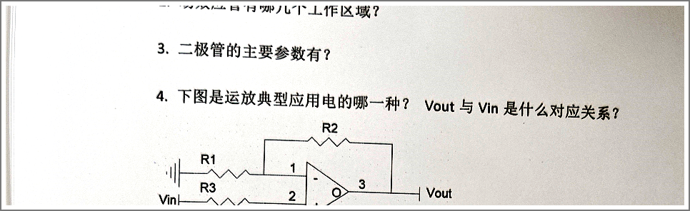

**363.** 电路分析：下图 T0 和 T1 是两个特性相同的管子，假设 β 无穷大，分析一下 IC1 与 IR 的关系？

**参考答案：** 这是电流镜电路。T0 的集电结短接（二极管接法）作参考支路；β→∞ 时基极电流 IB0≈IB1≈0，故 IC0≈IR。两管特性相同、UBE 相等，可得 IC1 = IC0 ≈ IR，即 T1 支路复制了参考电流，可用作恒流源与偏置。实际管子 β 有限时，基极电流由参考支路供给，存在小误差：IC1 ≈ IR/(1+2/β)。
**得分点：** ①结论 IC1≈IR ②机理（二极管接法、UBE 相同）③加分：有限 β 的误差公式或恒流源用途。
**来源：** 2026面试题-15 第 5 题（[图](../imgs/fig-5-current-mirror.png)）
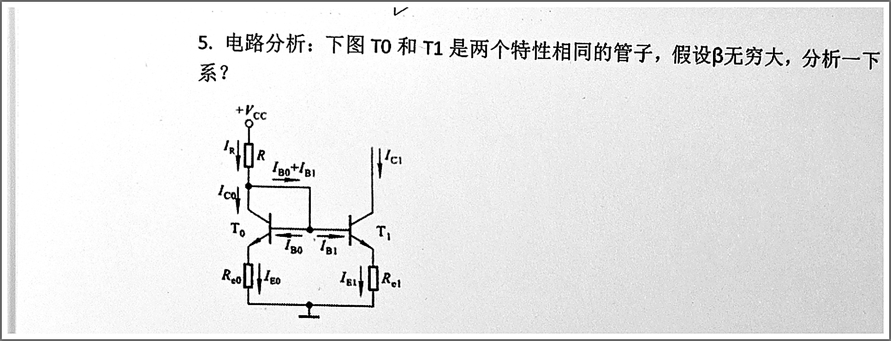

**365.** 电路分析：这是一个电源开关电路（Q1/Q2/EN1/MCU_IO），请简要说明一下工作原理？

**参考答案：** 这是两级级联的电平/开关控制：MCU_IO 经限流电阻驱动 Q2（低侧 NPN/NMOS）导通或截止；Q2 导通时把 Q1（高侧 PMOS/PNP）的栅极（基极）电位拉低，Q1 随之导通，VCC 经 Q1 送到 VOUT；Q2 截止时靠上拉电阻把 Q1 栅极拉到高电平，Q1 关断，VOUT 断电。R 提供偏置与限流，C 起滤波/软启动（抑制瞬态）作用；EN1 可作为使能或强制关断。答题按原图逐级说明正/负逻辑即可。
**得分点：** ①两级级联的导通/关断逻辑（含 Q1 高侧、Q2 低侧）②R/C 作用 ③加分：说明 PMOS 高侧开关的栅极电平与上拉/体二极管关系。
**来源：** 2026面试题-15 第 7 题（[图](../imgs/fig-7-power-switch.png)）
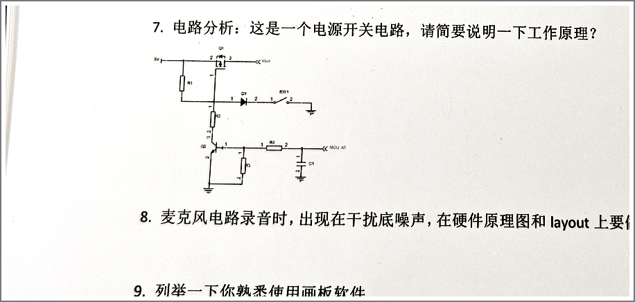


#### 2026面试题-18（电子工程师测试题）

**368b（续题号见上文）.** 二极管具有\_\_\_\_\_\_特性；常用的二极管有哪些（例如稳压二极管）\_\_\_\_\_\_；继电器的线圈两端反向并入一个二极管是属于\_\_\_\_\_\_二极管。三极管具有的三个状态为\_\_\_\_\_\_、\_\_\_\_\_\_、\_\_\_\_\_\_。三极管作为电子开关应用的什么状态\_\_\_\_\_\_。发光二极管的管脚正负极为长\_\_\_\_短\_\_\_\_？

**参考答案：** 单向导电（正向导通、反向截止）；常用二极管有整流（1N4007）、开关（1N4148）、稳压（齐纳）、发光 LED、肖特基、变容、光电二极管等；继电器线圈两端反向并联的是续流二极管（flyback），用于泄放线圈断电瞬间自感产生的反电动势、保护驱动三极管；三极管三状态为截止、放大、饱和；作电子开关用的是饱和（导通）与截止（关断）两态；LED 引脚长脚为正、短脚为负（内部电极小的一侧为正）。
**得分点：** ①单向导电 ②二极管种类与续流二极管 ③三极管三态与开关态 ④加分：LED 长正短负或反电动势保护机理。

**379.** 在下面三个逻辑符号上面对应注明逻辑名。

**参考答案：** 三种门符号与名称的对应：标 ≥1 的是或门（OR）、标 & 的是与门（AND）、标 =1 的是异或门（XOR）。口诀：有 1 则 1 是或，全 1 才 1 是与，相异为 1 是异或。答题时在对应符号上方写出门名即可（符号内的 ≥1、&、=1 就是识别标志）。
**得分点：** ①三种门名称与符号对应正确 ②加分：写出口诀或真值表。
**来源：** 2026面试题-18（[图](../imgs/fig-logic-gates.png)）
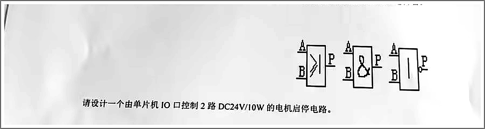

**380.** A pointer called *mpu641* of type *machine* is declared. What is the command to assign the value NULL to the field *memory*.

**参考答案：** `mpu641->memory = NULL;`。要点：mpu641 是结构体指针，访问成员要用箭头运算符 `->`（等价于 `(*mpu641).memory`）；赋值用单等号 =，双等号 == 是判断相等；若 mpu641 是结构体变量而非指针，则应写 `mpu641.memory = NULL;`。
**得分点：** ①语句正确 ②加分：说明 -> 与 . 的使用场合，以及赋值用 = 而非 ==。

---

#### 2026面试题-20（单片机开发工程师面试题）

**386.** 用三目运算编写一个带参数的宏，获取两个整数中最小的数。

**参考答案：** `#define MIN(a,b) ((a) < (b) ? (a) : (b))`。要点：两个参数各自加括号、整体再加一层，防止调用处优先级出错（如 MIN(x&1, y)）；宏会重复求值，实参带 i++ 等副作用时结果出错，工程上可用 static inline 函数替代。
**得分点：** ①三目形式正确 ②参数与整体括号完整 ③加分：副作用风险或 static inline 替代。


---

## 二、2022~2026 编程 / 画图大题汇编（80 题，编号 401~480）


### 2022 年

#### 2022面试题1

**401.** 编程实现画线函数（已有画点函数）或求过三点圆的圆心（二选一）：

```c
void DrawPixel(int x, int y, int pixColor);
// (a) 实现：
void DrawLine(int x1, int y1, int x2, int y2, int pixColor);
// (b) 已知圆上三点求圆心坐标。
```

**参考答案：**（a） 
```c
void DrawLine(int x1, int y1, int x2, int y2, int pixColor) {
    int dx = abs(x2-x1), sx = x1<x2?1:-1;
    int dy = -abs(y2-y1), sy = y1<y2?1:-1;
    int err = dx+dy, e2;
    while (1) {
        DrawPixel(x1, y1, pixColor);
        if (x1==x2 && y1==y2) break;
        e2 = 2*err;
        if (e2 >= dy) { err += dy; x1 += sx; }
        if (e2 <= dx) { err += dx; y1 += sy; }
    }
}
```
(b) 要点：用两点垂直平分线交点求圆心（解二元一次方程组），即 |P−A|²=|P−B|² 与 |P−A|²=|P−C|² 联立。
**得分点：** 算法正确性。

---

**402.** 请使用 Verilog 硬件描述语言实现 Serial2Parallel 模块（16 个 D 触发器：8 位移位 + 8 位锁存，输入 SerIn/SerClk/ParClk，输出 [7:0]ParDataOut）。

**参考答案：**
```verilog
module Serial2Parallel (
    input  wire SerIn, SerClk, ParClk,
    output wire [7:0] ParDataOut
);
    reg [7:0] shift_reg;
    reg [7:0] par_reg;

    always @(posedge SerClk)
        shift_reg <= {shift_reg[6:0], SerIn};

    always @(posedge ParClk)
        par_reg <= shift_reg;

    assign ParDataOut = par_reg;
endmodule
```
**得分点：** 移位寄存器 + 并行锁存结构。

---

**403.** ARM7TDMI 系统的寄存器映射操作（Reg_SerToPar 映射 0x20000000）：

**(a) 定义寄存器变量；(b) 读取效果说明；(c) 设置 bit1 保持其余位；(d) 实现 `SysSetBit(HwBit, HwValue)` 函数。**

**参考答案：**
```c
#define REG_SER_TO_PAR (*(volatile unsigned int *)0x20000000)  // (a)

/* (b) 读取不会被挂起：内存映射寄存器读回的是引脚状态（Bit0/1/2 为 SerIn/SerClk/ParClk 的回读或上次写入值），
      不属于异常中断源；具体视硬件实现，可能读回最后写入值 */

void set_bit1(void) { REG_SER_TO_PAR |= (1 << 1); }            // (c)

void SysSetBit(unsigned char HwBit, unsigned char HwValue) {   // (d)
    if (HwBit > 15) return;
    if (HwValue)
        REG_SER_TO_PAR |=  (1 << HwBit);
    else
        REG_SER_TO_PAR &= ~(1 << HwBit);
}
```
**得分点：** volatile 指针宏、位操作、参数校验。

---

**404.**（九）同步信号纠正电路：(a) 补划 B、C 点波形（按两级 D 触发器 + RC 延时逻辑推导）。

**参考答案：**B 点为输入 A 经一级打拍后的波形（额外脉冲被压窄/移位）；C 点为二级打拍 + RC 阈值后的输出，尖峰脉冲被滤除。画波形时注意与 A 的相位差（每个触发器延迟一个时钟）及 RC 充电斜坡。
**得分点：** 波形相位与滤波效果正确。
**来源：** 2022面试题1 第 9 题（[图](../imgs/fig-9-circuit.png)、[波形图](../imgs/fig-9-wave.png)）


---

#### 2022面试题2

**405.** 交换两个数 m=2 和 n=3，不用第三块儿内存。

**参考答案：**
```c
m = m ^ n;  n = m ^ n;  m = m ^ n;      // 异或法
// 或 m = m + n; n = m - n; m = m - n;   // 加减法（注意溢出）
```
**得分点：** 两种方法任一。

**406.** 输出 9*9 口诀。

**参考答案：**
```c
for (int i = 1; i <= 9; i++) {
    for (int j = 1; j <= i; j++)
        printf("%d*%d=%-4d", j, i, i*j);
    printf("\n");
}
```
**得分点：** 循环边界正确。

**407.** 写一个函数，完成内存之间的拷贝。

**参考答案：**（考虑重叠） 
```c
void *my_memcpy(void *dst, const void *src, size_t n) {
    char *d = dst; const char *s = src;
    if (d > s && d < s + n) {           // 重叠且目标在后：从尾到头
        d += n; s += n;
        while (n--) *--d = *--s;
    } else {
        while (n--) *d++ = *s++;
    }
    return dst;
}
```
**得分点：** 重叠处理（可选）+ 逐字节拷贝。

---

#### 2022面试题3

**408.** 请写出下面二叉树的前中后序（图见原卷）。

**参考答案：**按裁剪图（根 A，左子树 B（D、E），右子树 C）：前序 A→B→D→E→C；中序 D→B→E→A→C；后序 D→E→B→C→A。
**得分点：** 三种序列正确。
**来源：** 2022面试题3 编程题第 3 题（[图](../imgs/fig-3-tree.png)）
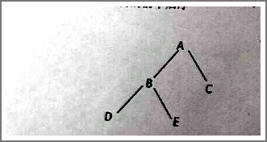

**409.** 请用 C 语言写一个冒泡排序。

**参考答案：**
```c
void bubble_sort(int a[], int n) {
    for (int i = 0; i < n - 1; i++) {
        int swapped = 0;
        for (int j = 0; j < n - 1 - i; j++)
            if (a[j] > a[j + 1]) {
                int t = a[j]; a[j] = a[j+1]; a[j+1] = t;
                swapped = 1;
            }
        if (!swapped) break;    // 优化：已有序提前退出
    }
}
```
**得分点：** 双层循环 + 交换逻辑。

---

#### 2022面试题4

**410.** 完成宏定义（其一：EPRINTF 打印 当前时间[行号@文件名]: 调用表达式；其二：WHEN 条件调用）。

**参考答案：**
```c
#define EPRINTF(func, fmt, args...) \
    { printf("%s [%d @ %s]: " #func ", " fmt, \
             get_local_time(), __LINE__, __FILE__, ##args); }

#define WHEN(func, act) \
    { if (func) { printf("%s [%d @ %s]: " #func ", " #act "\n", \
        get_local_time(), __LINE__, __FILE__); act; } }
```
**得分点：** 宏拼接（#、##）、__LINE__/__FILE__、可变参数。

**411.** 定义一个带函数指针的结构，并写示例代码。

**参考答案：**
```c
typedef struct {
    int  (*add)(int, int);
    int  (*sub)(int, int);
} CalcOps;

int add(int a, int b) { return a + b; }
int sub(int a, int b) { return a - b; }

int main(void) {
    CalcOps ops = { add, sub };
    printf("%d\n", ops.add(3, 4));   // 7
    printf("%d\n", ops.sub(3, 4));   // -1
    return 0;
}
```
**得分点：** 结构体内函数指针 + 调用。

**412.** 用 UML 表达硬盘、分区、目录、文件的关系，并写出类代码。

**参考答案：**UML 类图：HardDisk 1—* Partition 1—* Directory（自关联 parent-children）1—* File（继承 FileSystemNode）。参考代码：
```cpp
class FsNode { public: virtual ~FsNode() {} };
class File : public FsNode { /* size, name */ };
class Directory : public FsNode {
    std::vector<FsNode*> children;
};
class Partition { public: Directory root; };
class HardDisk { public: std::vector<Partition> parts; };
```
**得分点：** 组合/聚合关系 + 代码结构。

**413.** 用熟悉的语言实现一个交易处理模型（TCP 收报文→按交易码分发处理类→返回结果）。

**参考答案：**
```cpp
class Transaction {
public:
    virtual ~Transaction() {}
    virtual int parse(const char *msg, int len) = 0;
    virtual int process(char *resp, int &rlen) = 0;
    virtual int type() const = 0;
};

class TxRegistry {
    std::map<int, Transaction*> table;   // 交易码→处理类
public:
    void reg(Transaction *t) { table[t->type()] = t; }
    Transaction *find(int code) { return table.count(code) ? table[code] : nullptr; }
};

// 服务器循环：recv → 读交易码 → find → process → send
```
**得分点：** 多态分发 + 注册表。

**414.** SQL：求同一个号码的两次通话之间间隔大于 10 秒的通话记录 ID（表见原卷）。

**参考答案：**（MySQL 8 窗口函数） 
```sql
SELECT ID FROM (
  SELECT ID,
         TIMESTAMPDIFF(SECOND, 通话结束时间,
             LEAD(通话起始时间) OVER (PARTITION BY 主叫号码 ORDER BY 通话起始时间)) AS gap
  FROM calls
) t WHERE gap > 10;
```
（答案样例：6、7、8、9、10 条记录符合）
**得分点：** 窗口函数/自连接思路。

**415.** Linux shell：将指定目录下所有文件名改为小写。

**参考答案：**
```sh
#!/bin/bash
for f in "$1"/*; do
    n=$(basename "$f")
    mv "$f" "$1/$(echo "$n" | tr 'A-Z' 'a-z')"
done
```
**得分点：** 遍历 + tr + mv。

---

### 2023 年

#### 2023面试题-2（Anyka）

**416.**（8 分）修改下面的 GetMemory 代码（保持两个函数结构），保证程序正确执行：

```c
void GetMemory ( char* p, unsigned int size ) { p=(char*)malloc(size); return; }
void main (void) { char *str=NULL; GetMemory (str, 100); strcpy (str, "Anyka..."); printf(str); }
```

**参考答案：**（其二：返回分配指针亦可） 
```c
void GetMemory ( char** p, unsigned int size )
{
    *p = (char*)malloc(size);
    if (*p == NULL) { /* 错误处理 */ }
}
void main (void)
{
    char *str = NULL;
    GetMemory (&str, 100);
    if (str) { strcpy (str, "Anyka is a hi-tech company."); printf(str); free(str); }
}
```
**得分点：** 二重指针 + 判空释放。

**417.**（6 分）编写库函数 `char *strcpy(char *strDest, const char *strSrc)`。

**参考答案：**
```c
char *strcpy(char *strDest, const char *strSrc)
{
    char *p = strDest;
    while ((*p++ = *strSrc++) != '\0');
    return strDest;
}
```
**得分点：** 返回目标首地址 + 逐字符拷贝。

**418.**（6 分）已知 p 指向单向链表某非空节点，pTmp 指向独立新节点，不增加变量把 pTmp 插入到 p 之后。

**参考答案：**
```c
pTmp->next = p->next;
p->next = pTmp;
```
**得分点：** 顺序正确（先接后断）。

---

#### 2023面试题-3（软件试题）

**419.** 请描述一下三极管的用法，并画图举例（放大作用和开关作用）。

**参考答案：**画两个电路：①放大：共射放大电路（基极偏置电阻、集电极负载、输入小信号、输出反相放大）；②开关：基极经电阻接控制信号，集电极接负载（LED/继电器），饱和导通/截止。标注偏置条件（发射结正偏、集电结反偏=放大；两结正偏=饱和）。
**得分点：** 两种用法电路 + 偏置说明。

**420.** 画出单片机常用时钟电路和复位电路。

**参考答案：**时钟：晶振（两负载电容接地）+ 单片机 XTAL1/XTAL2；复位：上电复位 RC（R 接 VCC、C 接地，复位脚接 RC 节点，可加按钮并联放电）。
**得分点：** 两个电路完整。

**421.** 列举熟悉的设计模式及其定义，并写出单例（Singleton）示范例子。

**参考答案：**
```cpp
class Singleton {
public:
    static Singleton &getInstance() {
        static Singleton inst;      // C++11 起线程安全
        return inst;
    }
    Singleton(const Singleton &) = delete;
    Singleton &operator=(const Singleton &) = delete;
private:
    Singleton() {}
};
```
（模式列举：单例、工厂、观察者、策略、适配器等 + 各自一句话定义）
**得分点：** 模式列举 + 单例实现。

**422.** 写一个函数，用冒泡排序法对整型数组进行升序排序。

**参考答案：**同第 409 题。


**得分点：** 图形要素齐全（坐标 / 标注 / 元件与连线 / 波形相位）、结论与说明正确。

**423.** 已知 String 类定义，试写出类的成员函数实现（通用构造/拷贝构造/析构/赋值）。

**参考答案：**
```cpp
String::String(const char *str) {
    if (!str) { m_data = new char[1]; m_data[0] = '\0'; }
    else { m_data = new char[strlen(str)+1]; strcpy(m_data, str); }
}
String::String(const String &other) {
    m_data = new char[strlen(other.m_data)+1];
    strcpy(m_data, other.m_data);
}
String::~String() { delete [] m_data; }
String &String::operator=(const String &rhs) {
    if (this != &rhs) {                 // 自赋值检查
        delete [] m_data;
        m_data = new char[strlen(rhs.m_data)+1];
        strcpy(m_data, rhs.m_data);
    }
    return *this;
}
```
**得分点：** 深拷贝 + 自赋值 + 释放旧内存。

**424.** 角色扮演游戏生命状态设计（精神状态/策略模式/观察者，Architect 顶层设计）。

**参考答案：**①状态模式：角色生命状态类（精神饱满/正常/疲倦/危险/死亡），状态切换封装；②观察者模式：状态变化通知监听模块（UI 颜色等）；③顶层：Subject（角色状态）持观察者列表 + 事件总线；UML/伪代码给出关键类与接口。
**得分点：** 双模式组合 + 架构图。

---

#### 2023面试题-4

**425.**（20 分）给定字符串，去除重复字母后重新输出（如 "abcaadc"→"abcd"，长度 ≤10000）。

**参考答案：**（哈希表标记） 
```c
void dedup(char *s) {
    int seen[256] = {0};
    char *w = s;
    for (char *r = s; *r; r++) {
        unsigned char c = *r;
        if (!seen[c]) { seen[c] = 1; *w++ = c; }
    }
    *w = '\0';
}
```
**得分点：** O(n) 哈希思想。

---

#### 2023面试题-5

**426.** 写一程序：把 DWORD 秒数（2000-01-01 0:0:0 起）转为 "YYYY年MM月DD日 HH时mm分SS秒"。

**参考答案：**
```c
void sec2time(unsigned int sec) {
    static const int mdays[] = {31,28,31,30,31,30,31,31,30,31,30,31};
    int year = 2000, month = 1, day, hour, min, sec2p;
    // 逐年扣
    while (1) {
        int ydays = (year%4==0) ? 366 : 365;
        if (sec >= ydays*86400u) { sec -= ydays*86400u; year++; }
        else break;
    }
    // 逐月扣
    while (1) {
        int m = mdays[month-1];
        if (month==2 && year%4==0) m = 29;
        if (sec >= m*86400u) { sec -= m*86400u; month++; }
        else break;
    }
    day  = sec / 86400 + 1;  sec %= 86400;
    hour = sec / 3600;       sec %= 3600;
    min  = sec / 60;         sec2p = sec % 60;
    printf("%d年%02d月%02d日 %02d时%02d分%02d秒\n",
           year, month, day, hour, min, sec2p);
}
```
**得分点：** 闰年处理 + 逐级换算。

**427.** 如何实现键盘按下、键盘灯亮起、延迟 2 秒再关闭灯（wince 或 linux 伪码）。

**参考答案：**
```
打开键盘设备（/dev/input/eventX 或键盘驱动句柄）
while(1):
    阻塞读取按键事件
    if 按下事件:
        ioctl(设备, SET_LED, ON)   // 点亮键盘灯
        sleep(2) 或定时器 2 秒
        ioctl(设备, SET_LED, OFF)  // 关闭
```
**得分点：** 事件读取 + LED 控制 + 延时。

---

#### 2023面试题-6

**428.**（STM32）设计一组稳健的串口通信协议，画出采用空闲中断实现一帧数据的接收和解析流程图。

**参考答案：**协议：帧头（2B）+ 长度 + 命令 + 数据 + CRC 校验 + 帧尾。
流程图：串口 RX 中断/DMA 收字节入环形缓冲 → 总线空闲中断触发 → 取出缓冲区数据 → 校验帧头/长度/CRC → 通过则投递解析/应答，否则丢弃/重同步。
**得分点：** 协议帧格式 + 空闲中断解析流程。

---

### 2024 年

#### 2024面试题-1

**429.** 随机输入一个数，判断它是不是对称数（回文数）（如 3，121，12321，45254）。不能用字符串库函数。

**参考答案：**
```c
int is_palindrome(long x) {
    if (x < 0) return 0;
    long orig = x, rev = 0;
    while (x) { rev = rev*10 + x%10; x /= 10; }
    return rev == orig;
}
```
**得分点：** 数字反转比较。

**430.** 输入一组字符串数据（由 0-9,a-f,A-F 组成），需要转成 16 进制数据导出。例（"1234"）导出（0x12, 0x34）。

**参考答案：**
```c
int hex_val(char c) {
    if (c >= '0' && c <= '9') return c - '0';
    if (c >= 'a' && c <= 'f') return c - 'a' + 10;
    if (c >= 'A' && c <= 'F') return c - 'A' + 10;
    return -1;
}
int str_to_hex(const char *s, unsigned char *out, int max) {
    int n = 0;
    while (s[0] && s[1] && n < max) {
        int hi = hex_val(s[0]), lo = hex_val(s[1]);
        if (hi < 0 || lo < 0) break;
        out[n++] = (hi << 4) | lo;
        s += 2;
    }
    return n;
}
```
**得分点：** 两两组合 + 字符转数值。

**431.**（10 分）用 C 语言实现：uint16_t 高低字节交换（0x1234→0x3412），使用位操作。

**参考答案：**
```c
uint16_t swap_bytes(uint16_t x) {
    return (uint16_t)((x >> 8) | (x << 8));
}
```


**得分点：** 代码正确性（算法思路、边界条件、能编译运行）与复杂度说明。

**432.**（10 分）LED 控制寄存器地址 0x40021000（32 位，每位一个 LED），使第 3 位 LED 闪烁（用异或，忽略延时函数）。

**参考答案：**
```c
#define LED_REG (*(volatile uint32_t *)0x40021000)
while (1) {
    LED_REG ^= (1u << 3);
    delay();          // 题目说忽略延时函数
}
```


**得分点：** 代码正确性（算法思路、边界条件、能编译运行）与复杂度说明。

**433.**（10 分）16 位无符号整数位反转（0x1234→0x2C48）。

**参考答案：**
```c
uint16_t reverse_bits(uint16_t x) {
    uint16_t r = 0;
    for (int i = 0; i < 16; i++) {
        r = (uint16_t)((r << 1) | (x & 1));
        x >>= 1;
    }
    return r;
}
```


**得分点：** 代码正确性（算法思路、边界条件、能编译运行）与复杂度说明。

**434.**（10 分）8 位无符号整数奇偶校验：1 的个数为奇数返回 1，偶数返回 0。

**参考答案：**
```c
int parity8(uint8_t x) {
    int cnt = 0;
    while (x) { cnt += x & 1; x >>= 1; }
    return cnt & 1;
}
```


**得分点：** 代码正确性（算法思路、边界条件、能编译运行）与复杂度说明。

**435.**（15 分）编写 C 语言函数：8 位无符号整数转换为十六进制字符串。

**参考答案：**
```c
void u8_to_hexstr(uint8_t v, char *out) {
    const char *digits = "0123456789ABCDEF";
    out[0] = digits[v >> 4];
    out[1] = digits[v & 0x0F];
    out[2] = '\0';
}
```

**得分点：** 代码正确性（算法思路、边界条件、能编译运行）与复杂度说明。

---

#### 2024面试题-2

**436.** 编程求和 1-2+3-4+……+99-100。

**参考答案：**
```c
int sum = 0, sign = 1;
for (int i = 1; i <= 100; i++) { sum += sign * i; sign = -sign; }
printf("%d\n", sum);      // -50
// 或公式：-1 × 50 = -50
```
**得分点：** -50。

**437.**（10 分）根据单字节写入时序图（RST、SCLK、I/O：A0~A7、D0~D7），将程序补充完毕：

```c
Void SendByte(u8 Addr, u8 Data)
```

**参考答案：**
```c
void SendByte(u8 Addr, u8 Data)
{
    u8 i;
    RST = 0;                       // 复位拉低（按时序）
    delay();
    RST = 1;
    for (i = 0; i < 8; i++) {      // 先发 8 位地址 A0~A7（LSB 先）
        SCLK = 0;
        IO = (Addr >> i) & 1;
        SCLK = 1;                  // 上升沿写入
    }
    for (i = 0; i < 8; i++) {      // 再发 8 位数据 D0~D7
        SCLK = 0;
        IO = (Data >> i) & 1;
        SCLK = 1;
    }
    SCLK = 0;
}
```
**得分点：** 位循环 + 时钟沿匹配时序图。
**来源：** 2024面试题-2（[图](../imgs/fig-10-timing.png)）
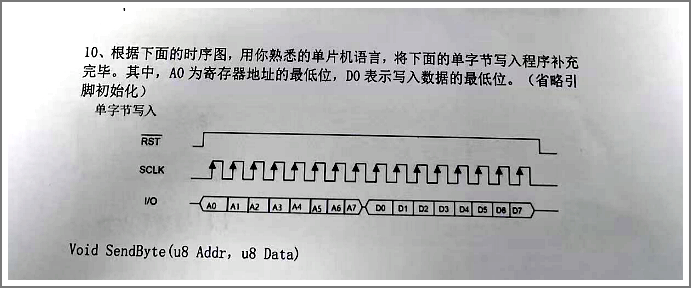

---

**438.** 用 c 语言，写冒泡排序程序。（同第 409 题）

**参考答案：** 同第 409 题。

**得分点：** 与同第 409 题相同（实现思路 + 边界处理）。

---

### 附（2024 其余大题题号合并说明）

- 2024面试题-3 试卷一：题 3、4（看图回答电路电平）已迁至本文件第一部分（原 02_主观题.md 第 124、125 题）。
- 2024面试题-4：GetMemory 相关、链表逆置填空均已迁至本文件第一部分（原 02_主观题.md）。

---

### 2025 年

**439.** 统计一个字符串里面出现次数最多的字符（可利用字符 ASCII 范围）。

**参考答案：**
```c
char get_max_char_in_strings(char *str)
{
    int cnt[256] = {0}, max = 0; char res = 0;
    for (char *p = str; *p; p++) {
        unsigned char c = *p;
        if (++cnt[c] > max) { max = cnt[c]; res = c; }
    }
    return res;
}
```
**得分点：** 计数哈希 + 取最大。

**440.**（20 分）使用指针实现一个函数，字符串中删除指定字符（"ababb" 删 'a' → "bbb"；删 'c' → "ababb"），并写测试例程。

**参考答案：**
```c
void delete_char(char *s, char c) {
    char *w = s;
    while (*s) {
        if (*s != c) *w++ = *s;
        s++;
    }
    *w = '\0';
}
// 测试：char t[]="ababb"; delete_char(t,'a'); puts(t); // bbb
```
**得分点：** 读写双指针原地删除。

**441.**（20 分）不用任何库函数，找到字符串中最长的由同一字符组成的子串起始与结束位置（"12ffffcced" → startpos=3, endpos=6）。

**参考答案：**
```c
void longest_same(const char *s, int *sp, int *ep) {
    int best_len = 0, i = 0;
    *sp = *ep = -1;
    while (s[i]) {
        int j = i;
        while (s[j] == s[i]) j++;
        if (j - i > best_len) { best_len = j - i; *sp = i; *ep = j - 1; }
        i = j;
    }
}
```
**得分点：** 滑窗/游程统计 + 起止下标更新。

**442.**（2025面试题-3 卷1 第 19 题）写一个 C 函数，将单向链表倒序排列。

**参考答案：**
```c
List *list_reverse(List *head)
{
    List *prev = NULL;
    while (head) {
        List *next = head->next;
        head->next = prev;
        prev = head;
        head = next;
    }
    return prev;
}
```
**得分点：** 三指针迭代反转。

**443.**（卷1 第 20 题）编写函数计算 n 个字节的数据中有多少位是 1。

**参考答案：**
```c
int countonenumber(BYTE b[], int n)
{
    int cnt = 0;
    for (int i = 0; i < n; i++) {
        BYTE v = b[i];
        while (v) { cnt++; v &= (v - 1); }
    }
    return cnt;
}
```
**得分点：** 每字节清零最低位计数。

**444.**（卷2 编程题）在 FreeRTOS 环境下创建两个任务：一个每 1 秒打印 "Task 1 is running"，另一个每 2 秒打印 "Task 2 is running"。

**参考答案：**
```c
void Task1(void *p) {
    while (1) { printf("Task 1 is running\n"); vTaskDelay(pdMS_TO_TICKS(1000)); }
}
void Task2(void *p) {
    while (1) { printf("Task 2 is running\n"); vTaskDelay(pdMS_TO_TICKS(2000)); }
}
int main(void) {
    xTaskCreate(Task1, "T1", 128, NULL, 1, NULL);
    xTaskCreate(Task2, "T2", 128, NULL, 1, NULL);
    vTaskStartScheduler();
    return 0;
}
```
**得分点：** API + 延时周期。

**445.**（卷5 第 4 题）请大致画出 SPI 的写 0x66（0110 0110）时序图（SDI、SDO、SCK、CS 四线）。

**参考答案：**CS 拉低 → 8 个 SCK 时钟周期，SDI 在每周期按 MSB-first 输出 0,1,1,0,0,1,1,0；SDO 同拍返回从机数据（可选）；画波形注意采样边沿（模式 0：上升沿采样）。
**得分点：** CS/SCK 时序 + 位序正确。

**446.**（卷5 第 4 题变体）请大致画出 I2C 的起始和结束时序图。

**参考答案：**起始：SCL 保持高时 SDA 由高→低跳变；停止：SCL 保持高时 SDA 由低→高跳变。画出 SCL 与 SDA 两条线及箭头注释。
**得分点：** 两条线的边沿关系正确。

**447.**（卷5 第 5 题）频率 10Hz 的 PWM，100% 占空比为 5V，绘制输出 2.5V 的波形图（带坐标系、标坐标值）。

**参考答案：**周期 100ms；50% 占空比方波：0~50ms 高（5V）、50~100ms 低（0V），重复 2~3 个周期；坐标轴 T(ms) 0/50/100，V 0/5。
**得分点：** 周期与占空比数值正确。

**448.** 编写一段 makefile：目标 lib.so 依赖 a.c；目标 target 依赖 lib（含 b.c）；默认编译 target。

**参考答案：**
```makefile
all: target

lib.so: a.c
	gcc -fPIC -shared -o lib.so a.c

target: lib.so b.c
	gcc -o target b.c -L. -l

clean:
	rm -f lib.so target
```
**得分点：** 依赖关系与默认目标。

**449.** 编写 strstr 函数（查找字符串子串）并说明。

**参考答案：**
```c
char *my_strstr(const char *hay, const char *needle) {
    if (!*needle) return (char *)hay;
    for (; *hay; hay++) {
        const char *h = hay, *n = needle;
        while (*h && *n && *h == *n) { h++; n++; }
        if (!*n) return (char *)hay;
    }
    return NULL;
}
```
说明：朴素匹配 O(n·m)；返回首次出现位置的指针，未找到返回 NULL。
**得分点：** 实现 + 复杂度说明。

**450.**【裕阳科技】（14 分）设计一个基于状态机的低功耗管理模块（运行：ADC 采样+通信；休眠：关外设等待外部中断；故障：记录日志进入安全状态），用伪代码或流程图描述状态切换逻辑及触发条件。

**参考答案：**
```c
typedef enum { RUN, SLEEP, FAULT } State;
State st = RUN;
void fsm_loop(void) {
    switch (st) {
    case RUN:
        adc_sample(); comm_poll();
        if (idle_timeout)     { disable_periph(); st = SLEEP; }
        if (error_detected)   { log_error();   st = FAULT; }
        break;
    case SLEEP:
        enter_low_power();                 // 等待 EXTI 唤醒
        if (wakeup_event)     { init_periph(); st = RUN; }
        break;
    case FAULT:
        safe_state(); log_flush();
        if (fault_cleared)    { init_periph(); st = RUN; }
        break;
    }
}
```
**得分点：** 三态 + 转换条件 + 低功耗动作。

**451.**（2025面试题-9）实现报警事件的环形缓冲区（QUEUE_SIZE 16、FireEvent{ID/Value/timestamp}），实现 initBuffer/enqueue/dequeue。

**参考答案：**
```c
struct ringbuffer_s {
    FireEvent buf[QUEUE_SIZE];
    volatile int head, tail;
};

void initBuffer(RingBuffer *q) { q->head = q->tail = 0; }

int enqueue(RingBuffer *q, FireEvent event) {
    int next = (q->head + 1) % QUEUE_SIZE;
    if (next == q->tail) return 0;          // 满
    q->buf[q->head] = event;
    q->head = next;
    return 1;
}

int dequeue(RingBuffer *q, FireEvent *event) {
    if (q->head == q->tail) return 0;       // 空
    *event = q->buf[q->tail];
    q->tail = (q->tail + 1) % QUEUE_SIZE;
    return 1;
}
```
**得分点：** 环形下标回绕 + 空满判断。

**452.**（小车卷）C 或其他语言实现（伪代码也可）：对一组随机 ip 地址进行排序。

**参考答案：**（C，按整数比较） 
```c
int ip_key(const char *ip) {                 // "a.b.c.d" → 32 位
    int a,b,c,d; sscanf(ip, "%d.%d.%d.%d", &a,&b,&c,&d);
    return (a<<24)|(b<<16)|(c<<8)|d;
}
// 排序：qsort(ips, n, sizeof(char*), cmp_by_key) 按 ip_key 比较即可
```
**得分点：** IP 转整型 + 排序。

---

### 2026 年

**453.**（20 分）指针实现字符串拼接（两个字符串拼到一起），并写测试例程。

**参考答案：**
```c
char *str_cat(char *dst, const char *src) {
    char *p = dst;
    while (*p) p++;
    while ((*p++ = *src++));
    return dst;
}
// 测试：char buf[64]="Hello, "; str_cat(buf,"World!"); puts(buf);
```
**得分点：** 找到结尾后逐字符追加。

**454.**（20 分）不用库函数，检查字符串括号是否匹配（"（11）2（33）（4）"匹配，"（113）3（"不匹配）。

**参考答案：**（计数器法，仅圆括号） 
```c
int brackets_match(const char *s) {
    int depth = 0;
    for (; *s; s++) {
        if (*s == '(' || *s == '（') depth++;
        else if (*s == ')' || *s == '）') {
            if (--depth < 0) return 0;
        }
    }
    return depth == 0;
}
```
**得分点：** 深度计数 + 提前失败。

**455.**（粤嵌）两个升序数组 A 和 B，将 B 全部合并到 A 并保持有序（A 前 N 个有效，空间足够）。

**参考答案：**（从后往前） 
```c
void merge(int *A, int n, int *B, int m) {
    int i = n - 1, j = m - 1, k = n + m - 1;
    while (j >= 0)
        A[k--] = (i >= 0 && A[i] > B[j]) ? A[i--] : B[j--];
}
```
**得分点：** 尾部双指针。

**456.**（粤嵌）写出中序遍历二叉树的代码。

**参考答案：**
```c
void inorder(Node *root) {
    if (!root) return;
    inorder(root->left);
    printf("%d ", root->data);
    inorder(root->right);
}
```
**得分点：** 递归顺序。

**457.**（粤嵌）不使用库函数，实现 `int strcmp(char *source, char *dest)`，相等返回 0，不等返回-1。

**参考答案：**
```c
int my_strcmp(char *source, char *dest) {
    while (*source && *source == *dest) { source++; dest++; }
    return (*source == *dest) ? 0 : -1;
}
```
**得分点：** 逐字符比较。

**458.**（粤嵌·附加）大地经纬度（B,L）转地心直角坐标 X、Y、Z。

**参考答案：**（WGS84） 
```c
// B 纬度, L 经度（弧度）, H 高程; a=6378137, e2=0.00669437999014
double N = a / sqrt(1 - e2 * sin(B) * sin(B));
X = (N + H) * cos(B) * cos(L);
Y = (N + H) * cos(B) * sin(L);
Z = (N * (1 - e2) + H) * sin(B);
```
**得分点：** 公式正确。

**459.** 编写程序：使用冒泡排序法排序数组。（同第 409 题，另见 2026面试题-11 第 4 题、2026面试题-20 第 8 题）


**参考答案：** 同第 409 题。

**得分点：** 与同第 409 题相同（实现思路 + 边界处理）。

**460.** 编写程序：将一个字符串转换成整数（Atoi）。

**参考答案：**
```c
int Atoi(char str[])
{
    int i = 0, sign = 1, num = 0;
    if (str[i] == '-') { sign = -1; i++; }
    else if (str[i] == '+') i++;
    while (str[i] >= '0' && str[i] <= '9')
        num = num * 10 + (str[i++] - '0');
    return sign * num;
}
```
**得分点：** 符号 + 逐位累加。

**461.** 编写程序：将一个链表逆序。（同第 442 题实现）


**参考答案：** 同第 442 题。

**得分点：** 与同第 442 题相同（实现思路 + 边界处理）。

**462.**（2026面试题-6）实现固定长度循环队列（uint8_t，容量 10）：结构体、InitQueue、IsQueueEmpty、IsQueueFull（牺牲一个单元）、EnQueue、DeQueue。

**参考答案：**
```c
#define QSIZE 10
typedef struct {
    uint8_t data[QSIZE];
    int head, tail;
} Queue;

void InitQueue(Queue *q) { q->head = q->tail = 0; }
int IsQueueEmpty(Queue *q) { return q->head == q->tail; }
int IsQueueFull(Queue *q)  { return (q->tail + 1) % QSIZE == q->head; }

int EnQueue(Queue *q, uint8_t v) {
    if (IsQueueFull(q)) return 0;
    q->data[q->tail] = v;
    q->tail = (q->tail + 1) % QSIZE;
    return 1;
}
int DeQueue(Queue *q, uint8_t *v) {
    if (IsQueueEmpty(q)) return 0;
    *v = q->data[q->head];
    q->head = (q->head + 1) % QSIZE;
    return 1;
}
```
**得分点：** 牺牲一个单元的空满判定。

**463.**（2026面试题-7）（25 分）求运放电路的放大倍数（含 T 型反馈网络，鼓励设等值化简）。

**参考答案：**用虚短虚断列方程，按 T 型网络（R2、R3、R4）推导 Vout/Vin 表达式；设 R2=R3=R4=R 等化简化简（或按原图给定倍数关系）。
**得分点：** 列式推导 + 表达式。
**来源：** 2026面试题-7（[图](../imgs/fig-1-opamp.png)）
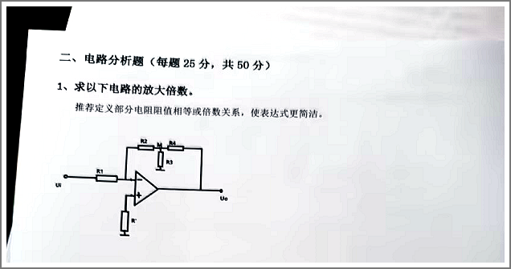

**464.**（2026面试题-7）请画一个三运放仪表放大电路，并推导其放大倍数。

**参考答案：**画三个运放：前级两个同相放大器（增益 1+2R/Rgain），后级差分放大器；推导总增益 G=(1+2R/Rgain)·(R2/R1)。
**得分点：** 电路 + 推导。

**465.** 请编写一个内存拷贝函数，实现 C/C++ 中 memcpy 的功能。

**参考答案：**同第 407 题（my_memcpy）。


**得分点：** 图形要素齐全（坐标 / 标注 / 元件与连线 / 波形相位）、结论与说明正确。

**466.** 实现算法：在[1, 100]区间内随机生成 N 个不重复的整数（O(N)），接口 `int RandNum(int x)`。

**参考答案：**（洗牌法） 
```cpp
void GetRandomNumbers(int n, std::vector<int> &result) {
    static int pool[100];
    static bool init = false;
    if (!init) { for (int i = 0; i < 100; i++) pool[i] = i + 1; init = true; }
    for (int i = 0; i < n; i++) {           // 前 n 个位置做部分洗牌
        int j = RandNum(100 - i) - 1 + i;   // [i, 99]
        std::swap(pool[i], pool[j]);
        result.push_back(pool[i]);
    }
}
```
**得分点：** O(N) 洗牌/去重思路。

**467.**（积积科技·12 分）编写 C 函数实现智能电表数据包封装：数据域 4 字节浮点电量 + AES-128 加密 + CRC16 校验。

**参考答案：**
```c
void build_telemetry_packet(float energy, uint8_t *output) {
    uint8_t plain[4];
    memcpy(plain, &energy, 4);                 // 1. 数据域
    uint16_t crc = crc16(plain, 4);            // 3. 先算校验
    uint8_t buf[6];
    memcpy(buf, plain, 4); memcpy(buf + 4, &crc, 2);
    aes128_encrypt(buf, 6, output, key);       // 2. 加密输出
}
```
**得分点：** 数据布局 + 加密/校验调用顺序。

**468.**（2026面试题-11）用 C 语言编写代码求出数组 `int a[10]` 中的最大最小值。

**参考答案：**
```c
int max = a[0], min = a[0];
for (int i = 1; i < 10; i++) {
    if (a[i] > max) max = a[i];
    if (a[i] < min) min = a[i];
}
printf("max=%d min=%d\n", max, min);
```
**得分点：** 一趟遍历。

**469.** 使用 C/C++ 实现冒泡排序。（同第 409 题）


**参考答案：** 同第 409 题。

**得分点：** 与同第 409 题相同（实现思路 + 边界处理）。

**470.**（2026面试题-13）用链表实现一个栈，支持 push、pop、top、empty。

**参考答案：**
```c
typedef struct Node { int v; struct Node *next; } Node;
typedef struct { Node *top_; int size; } Stack;

void  init(Stack *s)        { s->top_ = NULL; s->size = 0; }
int   empty(Stack *s)       { return s->top_ == NULL; }
void  push(Stack *s, int v) { Node *n = malloc(sizeof(Node)); n->v = v; n->next = s->top_; s->top_ = n; s->size++; }
int   pop(Stack *s)         { Node *n = s->top_; int v = n->v; s->top_ = n->next; free(n); return v; }
int   top(Stack *s)         { return s->top_->v; }
```
**得分点：** 头插法 + 各操作。

**471.**（附加题 20 分）实现函数：在单向链表中删除所有值等于指定值的节点。

```cpp
ListNode* removeElements(ListNode* head, int val);
```

**参考答案：**（哨兵节点） 
```cpp
ListNode* removeElements(ListNode* head, int val) {
    ListNode dummy{0, head}, *p = &dummy;
    while (p->next) {
        if (p->next->val == val) {
            ListNode *del = p->next;
            p->next = del->next;
            delete del;
        } else {
            p = p->next;
        }
    }
    return dummy.next;
}
```
**得分点：** 哨兵处理头节点删除。

**472.**（2026面试题-17）不额外分配空间，实现字符串逆序，并写测试例程。

**参考答案：**
```c
void str_reverse(char *s) {
    char *e = s + strlen(s) - 1;
    while (s < e) { char t = *s; *s++ = *e; *e-- = t; }
}
// 测试：char t[]="hello"; str_reverse(t); puts(t); // olleh
```
**得分点：** 双指针原地交换。

**473.**（2026面试题-17）找出不含重复字符的最长子串长度（abcabcbb → 3）。

**参考答案：**（滑动窗口） 
```c
int length_of_longest_substring(const char *s) {
    int last[256], start = 0, best = 0;
    for (int i = 0; i < 256; i++) last[i] = -1;
    for (int i = 0; s[i]; i++) {
        unsigned char c = s[i];
        if (last[c] >= start) start = last[c] + 1;
        last[c] = i;
        if (i - start + 1 > best) best = i - start + 1;
    }
    return best;
}
```
**得分点：** 滑窗 + 上次位置。

**474.**（2026面试题-18）简单绘制 89C51 的阻容复位电路。

**参考答案：**画 R（如 10K）从 VCC 接 RST，C（如 10μF）从 RST 到 GND；可选并联按键与二极管；说明上电时 RST 高电平复位延时。
**得分点：** R/C 接法。

**475.**（2026面试题-18）请设计一个由单片机 IO 口控制 2 路 DC24V/10W 的电机启停电路。

**参考答案：**每路：IO → 三极管/MOS（或光耦隔离）→ 继电器/驱动管 → 电机（24V 电源侧加续流二极管、滤波）；标注参数（继电器触点电流 ≥ 10W/24V ≈ 0.42A，留裕量）。
**得分点：** 驱动 + 保护元件。

**476.**（2026面试题-18）画出用一只三极管将输入的高低电平信号翻转，以供当单片机检测。

**参考答案：**NPN 共射反相器：输入经基极电阻，集电极经上拉电阻接 VCC，输出取集电极——输入高时输出低，输入低时输出高（反相）；说明电阻取值使管处于开关状态。
**得分点：** 共射反相电路正确。

**477.**（2026面试题-18）数组 `a={10,2,3,4,5,6,9,8,7,1}`，用熟悉的编程语言由小到大排序。

**参考答案：**冒泡或 qsort（同第 409 题）。
```c
qsort(a, 10, sizeof(int), cmp_int);
```
**得分点：** 排序正确。

**478.**（2026面试题-21）请用 C 语言编写按键扫描函数（GPIO 低电平触发，含软件消抖，检测到按下打印 "Key Pressed!"）。

**参考答案：**
```c
void key_scan(void)
{
    if (GPIO_ReadInputDataBit(KEY_GPIO_PORT, KEY_PIN) == 0) {  // 低电平
        delay_ms(10);                                          // 消抖
        if (GPIO_ReadInputDataBit(KEY_GPIO_PORT, KEY_PIN) == 0) {
            printf("Key Pressed!\r\n");
            while (GPIO_ReadInputDataBit(KEY_GPIO_PORT, KEY_PIN) == 0); // 等待释放
        }
    }
}
```
**得分点：** 低电平判断 + 延时复检 + 打印。

**479.**（2026面试题-21）用伪代码或 C 语言描述一个 BLE 从机设备的初始化流程（协议栈初始化、广播设置、服务与特征值创建）。

**参考答案：**
```c
ble_init();                       // 初始化协议栈/驱动
gap_set_device_name("MyDev");     // 设备名/参数
gap_set_adv_data(adv_data, len);  // 广播数据（服务 UUID 等）
gap_start_advertising();          // 开始广播
// 连接后：
gatt_add_service(uuid, primary);               // 创建服务
gatt_add_characteristic(uuid, props, handler); // 创建特征值
// 事件循环：连接/断开/读写回调处理
```
**得分点：** 初始化→广播→服务/特征值 顺序。

**480.**（2026面试题-22）请大致画出 i2c 的起始和结束时序图。

**参考答案：**起始：SCL 高电平期间 SDA 由高→低；停止：SCL 高电平期间 SDA 由低→高。画两条时序线并标注电平跳变位置。
**得分点：** 两条线的边沿关系。

---

---

## 附：统计

- 第一部分（从主观题迁出）：**33 题** —— 配图 / 电路 / 波形类 20 题 + 要求写代码类 13 题
- 第二部分（试卷大题汇编）：**80 题** —— 编号 401~480
- 合计：**113 题**
- 说明：
  - 迁出题目编号沿用 `02_主观题.md` 原编号（6、7、8、29 … 386），故第一部分编号不连续。
  - 第二部分原为 1~80 号，为避免与第一部分编号冲突，统一加 400（1→401 … 80→480）。

